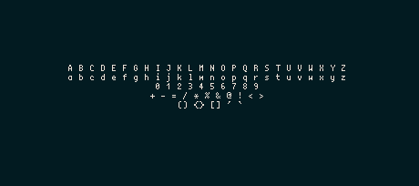
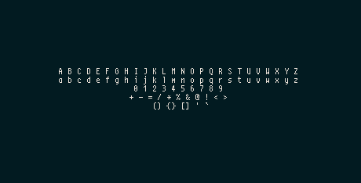
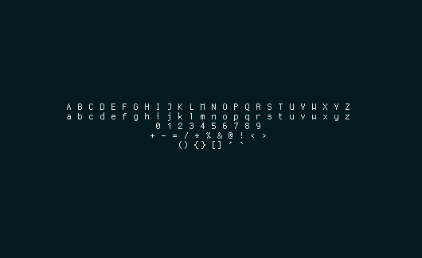
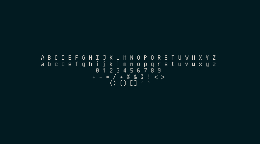

## Description

cherry is yet another bitmap font, made for latin 1

## Screenshots

#### 10px


#### 11px


#### 12px


#### 13px


## Installation

#### Arch

[AUR package](https://aur.archlinux.org/packages/cherry-font-git/)

#### NixOS

[NixOS package](https://github.com/nixos/nixpkgs/tree/master/pkgs/data/fonts/cherry)

#### Crux

[Crux Port](https://github.com/turquoise-hexagon/ports/tree/master/cherry-otb)

#### Void Linux
```
# xbps-install -S cherry-font
```

#### X11

```
$ ./make.sh
$ mv *.otb /path/to/cherry-font/out # example : ~/.local/share/fonts
$ mkfontdir /path/to/cherry-font/out
$ xset +fp /path/to/cherry-font/out # every time X starts
```

#### Fontconfig

```
$ ./make.sh
$ mv *.otb /path/to/cherry-font/out # must be a directory scanned by fontconfig
$ fc-cache -fv
```
